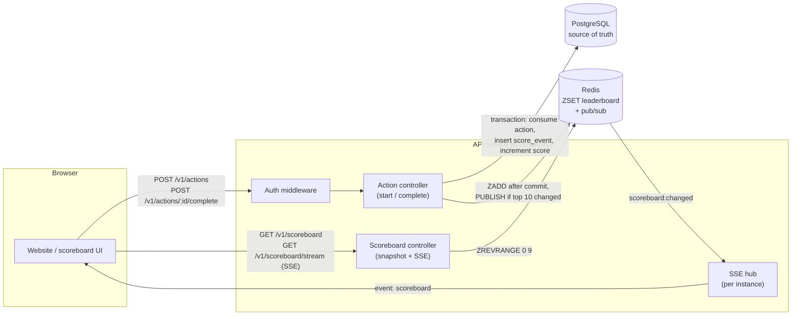
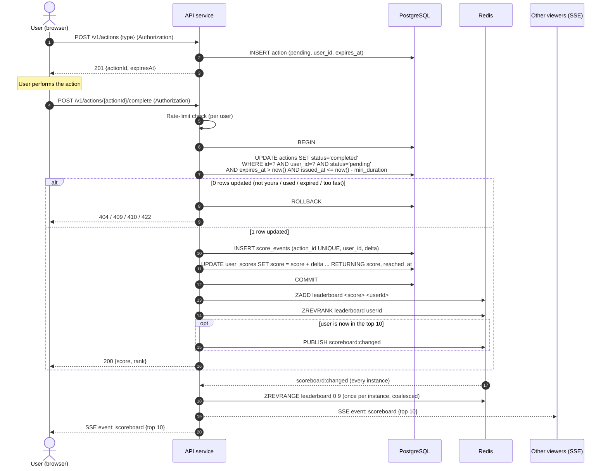

# Scoreboard Module

A module in the API service that keeps track of user scores and powers the live top 10
scoreboard on the website.

It is responsible for:

- updating a user's score when they complete an action
- returning the current top 10
- pushing scoreboard changes to open browsers in real time
- making sure scores can't be increased without authorisation

## Assumptions

- Users are already logged in through the existing auth system, so every request carries a
  session or JWT that resolves to a user ID.
- The action happens on the client, so the server can't fully verify it. If the server
  *can* verify it, that's a better option (see "Future improvements").
- Each action type is worth a fixed number of points, configured on the server. The
  client never sends a score or a points value.
- The scoreboard is public and shows display name and score only.
- "Live" means within about a second. Clients only need the latest top 10, not every
  individual change.
- If two users have the same score, the one who reached it first ranks higher.

## Architecture



- PostgreSQL is the source of truth for scores, actions and the score history.
- A Redis sorted set (`leaderboard`) holds the ranking. Reading the top 10 is a single
  `ZREVRANGE 0 9`, which stays fast no matter how many people are watching. Running
  `ORDER BY score DESC LIMIT 10` against Postgres on every read would not.
- Redis pub/sub (`scoreboard:changed`) tells every API instance that the top 10
  changed. This is needed because browsers are connected to different instances.
- The SSE hub is the list of open stream connections on each instance. When it gets a
  change notification, it reads the top 10 once and sends it to all of them.

Redis is only needed when the API runs on more than one instance. With a single instance,
the top 10 can be kept in memory, refreshed from Postgres after each score change, and
sent straight to the open streams. Redis can be added once the service is scaled out.

Server-Sent Events are used instead of WebSockets because data only flows one way (server
to browser). SSE is plain HTTP, works with the existing load balancer and auth, and
browsers reconnect automatically.

## Flow of execution



The brief describes a single API call when the action finishes. This design adds a
second call, `POST /v1/actions`, when the action starts. Without it, the server has no way
to tell a real completion from someone calling the endpoint in a loop. The start call
gives the server an action it issued itself, which it can tie to the user, expire and
accept only once.

A few things to note:

- The action is marked completed with a single conditional `UPDATE`. That one statement
  checks ownership, single use, expiry and minimum duration, so two parallel `complete`
  calls for the same action can't both succeed.
- The score is incremented in SQL (`score = score + delta`) rather than read, modified and
  written back, so parallel completions don't overwrite each other.
- Redis is only updated after the transaction commits. If Redis is down, the score is
  still saved and the leaderboard catches up later.
- A broadcast is only published when the user ends up in the top 10. Most updates come
  from users outside it and don't trigger anything.

## API

All endpoints are under `/v1` and use JSON. Errors look like
`{ "error": { "code": "...", "message": "..." } }`.

### `POST /v1/actions`: start an action

Requires auth.

```json
// request
{ "type": "daily_quiz" }

// 201
{ "actionId": "01J9Z4Q6…", "expiresAt": "2026-09-30T10:15:00Z" }
```

Errors: `400` unknown type, `401` not logged in, `429` rate limited.

`actionId` is a random UUID/ULID tied to the user in the database. On its own it's not
enough to complete the action: the same user's auth is also required.

### `POST /v1/actions/{actionId}/complete`: complete an action

Requires auth. No request body, because the server decides the points from the action
type.

```json
// 200
{ "score": 1840, "rank": 7 }
```

| Status | Meaning                                                                  |
| ------ | ------------------------------------------------------------------------ |
| 200    | Points added                                                             |
| 401    | Not logged in                                                            |
| 404    | Action doesn't exist or belongs to someone else (same response on purpose) |
| 409    | Already completed. Safe for the client to treat as success when retrying |
| 410    | Expired                                                                  |
| 422    | Completed faster than the action's minimum duration                      |
| 429    | Rate limited                                                             |

`rank` is `null` when the user is outside the top 10,000.

### `GET /v1/scoreboard`: current top 10

Public. Can be cached for about a second.

```json
{
  "updatedAt": "2026-09-30T10:12:03.120Z",
  "entries": [
    { "rank": 1, "userId": "u_8f2…", "displayName": "alice", "score": 9120 },
    { "rank": 2, "userId": "u_1c9…", "displayName": "bob", "score": 8870 }
  ]
}
```

### `GET /v1/scoreboard/stream`: live updates

An SSE stream (`text/event-stream`). It sends the current top 10 as soon as the client
connects, then again every time it changes:

```
event: scoreboard
data: {"updatedAt":"…","entries":[…]}
```

A `: keep-alive` comment is sent every 25 seconds so proxies don't drop idle connections.

Each event contains the full top 10, not a diff. A client that reconnects after missing
events is correct again after the next event, so there's no need for replay or
`Last-Event-ID`.

```js
const es = new EventSource("/v1/scoreboard/stream");
es.addEventListener("scoreboard", (e) => render(JSON.parse(e.data).entries));
```

## Preventing unauthorised score increases

Anything the website can send, an attacker can send too, so hiding or obfuscating the
endpoint doesn't help. Instead, the design limits what a forged request can do:

| Attack                                            | Protection                                                                 |
| ------------------------------------------------- | -------------------------------------------------------------------------- |
| Calling the API without logging in                | Write endpoints require auth. The user ID is only taken from the session/JWT, never from the request |
| Completing someone else's action                  | Actions are tied to a user, and the `UPDATE` checks it                     |
| Sending a big points value                        | Requests don't contain points. The server looks them up by action type     |
| Replaying a completed action                      | `status = 'pending'` in the `UPDATE`, plus a unique `action_id` on `score_events` |
| Completing without starting, or instantly         | Actions are issued by the server, expire, and have a minimum duration      |
| Scripting start, wait, complete in a loop          | Per-user rate limits on both endpoints and a daily points cap per action type |
| CSRF                                              | Bearer token in the `Authorization` header, or `SameSite` cookies with a CSRF token |
| Abuse that gets through anyway                    | Every increment is recorded in `score_events`. Alert on unusual points per hour. Admins can void events and recalculate |
| Flooding the SSE endpoint                         | Limit concurrent streams per IP and per instance                           |

One limitation should be clear to product: if the action happens entirely in the browser,
someone can still automate it within the rate limits. These controls limit the damage,
but they can't prove a real person did the action. Fixing that requires verifying the
action on the server, or adding something like a CAPTCHA.

## Data model

```sql
CREATE TABLE user_scores (
  user_id     UUID PRIMARY KEY REFERENCES users(id),
  score       BIGINT      NOT NULL DEFAULT 0 CHECK (score >= 0),
  reached_at  TIMESTAMPTZ NOT NULL DEFAULT now(),   -- when the current score was reached, used for ties
  updated_at  TIMESTAMPTZ NOT NULL DEFAULT now()
);

CREATE TABLE actions (
  id            UUID PRIMARY KEY,
  user_id       UUID        NOT NULL REFERENCES users(id),
  type          TEXT        NOT NULL,
  status        TEXT        NOT NULL CHECK (status IN ('pending', 'completed')),
  issued_at     TIMESTAMPTZ NOT NULL DEFAULT now(),
  expires_at    TIMESTAMPTZ NOT NULL,
  completed_at  TIMESTAMPTZ
);
CREATE INDEX ON actions (user_id, issued_at);

-- append-only history of every score change
CREATE TABLE score_events (
  id          BIGSERIAL PRIMARY KEY,
  action_id   UUID        NOT NULL UNIQUE REFERENCES actions(id),
  user_id     UUID        NOT NULL REFERENCES users(id),
  delta       INTEGER     NOT NULL,
  created_at  TIMESTAMPTZ NOT NULL DEFAULT now()
);
```

Each action type's points, minimum duration and expiry are kept in config.

Redis keys:

- `leaderboard`: sorted set of `userId` by score.
- `user:names`: hash mapping `userId` to `displayName`, so broadcasts don't have to hit the
  database for names.
- `scoreboard:changed`: pub/sub channel. The message is empty; listeners just re-read the
  top 10.

Redis sorts equal scores by member name, not by who got there first. To get the
tie-breaking rule, read the top 10, fetch anyone tied with 10th place, and sort those by
`reached_at`. With a top 10, that's a small extra query.

Postgres is always the source of truth, and the Redis sorted set can be rebuilt from it.
A failed `ZADD` is logged and retried. Since `ZADD` sets an absolute score, the user's
next update fixes it anyway. On startup, and every few minutes, a job reloads the top
1,000 from `user_scores` in case anything was missed.

## Operations

- Throttle broadcasts. Each instance pushes to its clients at most once every
  250–500 ms and always sends the latest top 10. A burst of changes doesn't turn into a
  burst of messages.
- Scaling. Instances only hold SSE connections, no other state, so they can scale
  horizontally. The load balancer needs to allow long-lived responses and not buffer the
  stream route.
- Monitoring. Track completions per second, rejections by reason, transaction latency,
  Redis write failures, open SSE connections and broadcast delay. Log `userId`, `actionId`
  and request ID on every write. Alert on spikes in rejections or unusual points per user.

What happens when things fail:

| Failure              | Behaviour                                                                                      |
| -------------------- | ---------------------------------------------------------------------------------------------- |
| Postgres is down     | `complete` returns 503. No points are added, and the client can retry with the same `actionId` |
| Redis is down        | Scores are still saved. The top 10 is read from Postgres (briefly cached). Live updates pause until Redis is back |
| An instance dies     | Its SSE clients reconnect to another instance and get a fresh top 10                           |
| Client retries `complete` | The second call gets 409, which the client can treat as success                           |

## Future improvements

1. Verify actions on the server where possible. If the action produces something the
   server can check (a quiz answer, a purchase, a validated game move), award the points
   as part of that request and drop the separate `complete` endpoint. That removes most
   of the ways to fake a score.
2. Daily or weekly leaderboards. Use one sorted set per period (e.g.
   `leaderboard:2026-W40`) with a TTL. `score_events` already has timestamps, so no
   schema changes are needed.
3. Outbox pattern. If Redis falling behind becomes a real issue, write an outbox row
   in the same transaction and let a worker apply it to Redis.
4. Show the user's own rank next to the top 10 with `ZREVRANK`.
5. Load test the SSE fan-out before launch, to decide how many connections each
   instance can hold.
